# react 招聘实时聊天

#### 项目介绍
基于scoket.io的不同角色招聘实时聊天项目

#### 项目预览

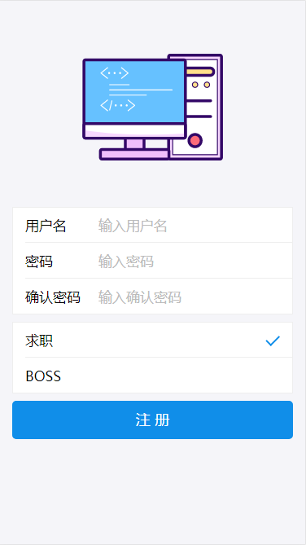
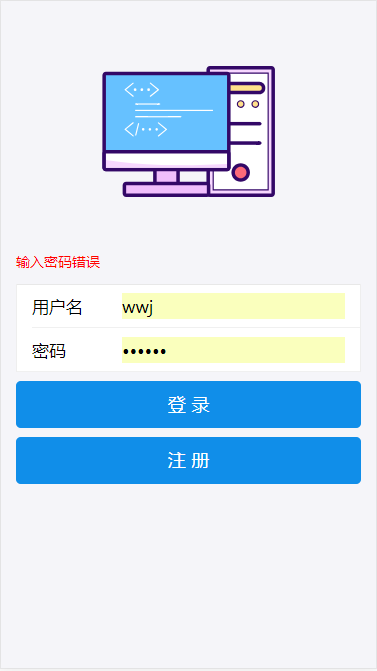
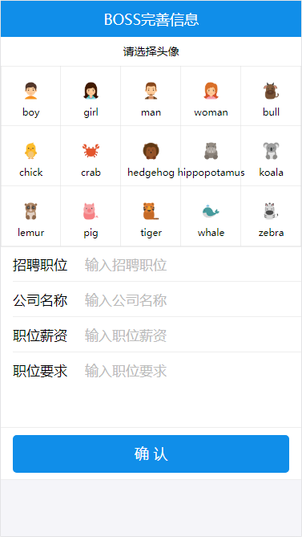
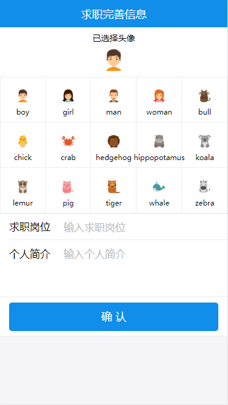
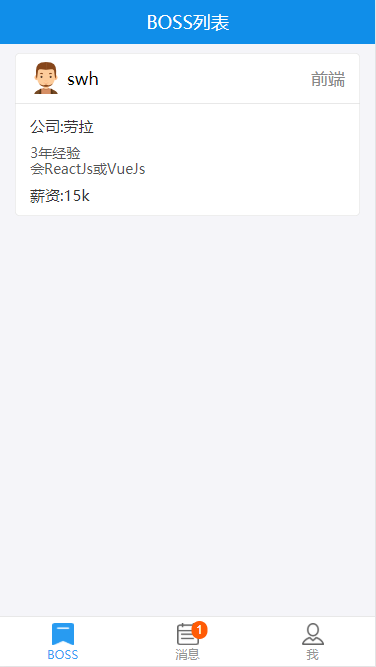
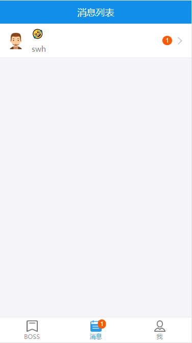
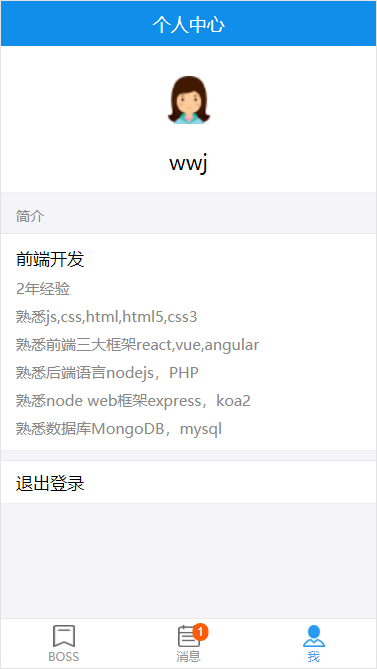
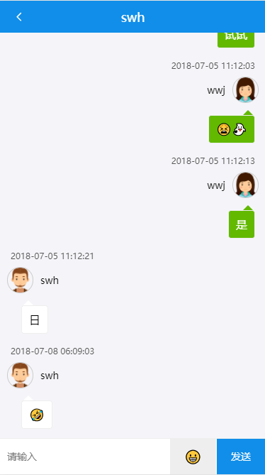
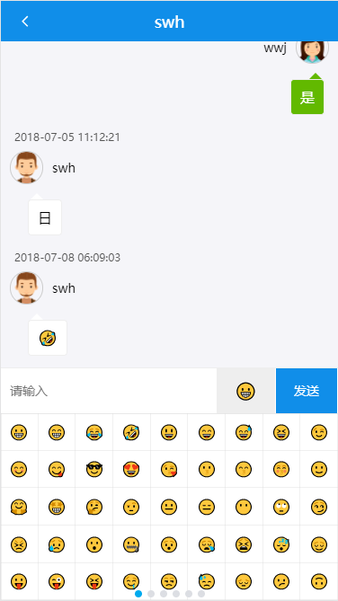
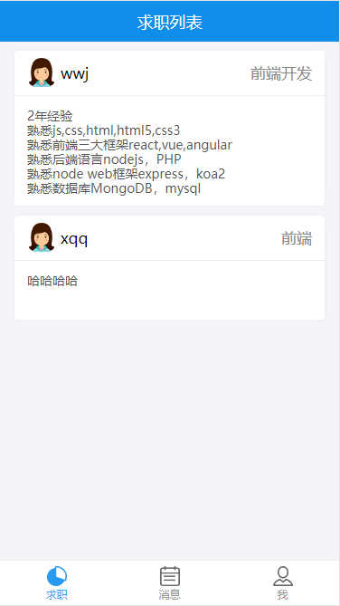
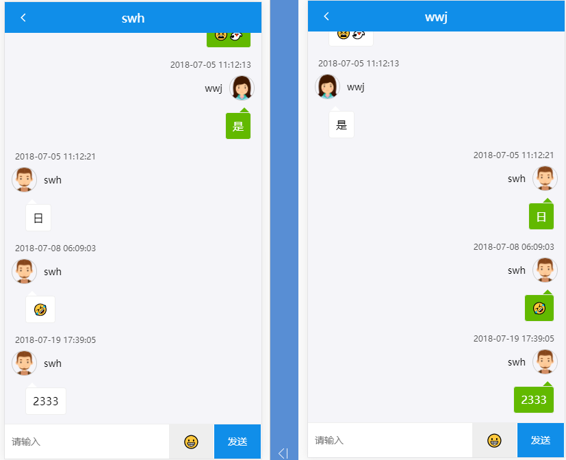

#### 软件架构
软件架构说明

- 后端
    - nodejs
- 前端
    - react、react-router、react-redux、redux、es6、es7、antd-mobile UI框架、socket-client、axios
- 数据库
    - mongodb
- 服务器
    - nodejs-express、socket.io、es6

#### 安装教程

1. 安装了node
2. 导入数据库
    - 安装mongodb 
    - 开启mongodb
    - 数据文件夹在doc文件夹内
    - mongodb导入：mongorestore -h dbhost -d dbname path 
    - dbhost是mongodb的IP，dbname是数据库的名字，path是doc里的数据库文件夹
    - 如下：
    - mongorestore -h 127.0.0.1 -d cmmobile ./cmmobile
3. npm install 或者 yarn install
4. 确认数据库已经开启，然后在根文件夹node app.js就可以了
5. 打开网页 http://localhost:8080/

#### 使用说明

1. 目录
```
├─doc               相关文件
│  ├─cmmobile       数据库文件夹
│  └─view
├─models            mongoose模型
├─node_modules   
├─routes            路由分发业务
├─static            图片等静态资源
├─www               react前端相关目录
│  ├─dist           编译后放后端的前端
│  └─src            react前端源码
├─app.js            入口文件，scoket入口业务
```
2. 开发时请输入npm start开启webpack自动编译dist
3. 开启node服务器 npm server，请确保mongodb已经开启，并且导入了数据
4. 测试修改

